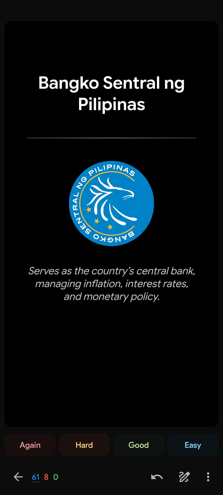
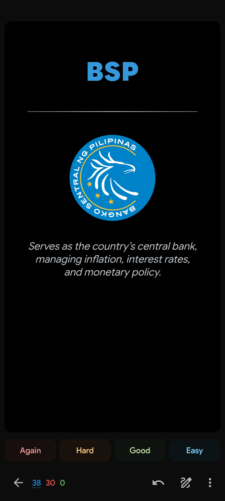
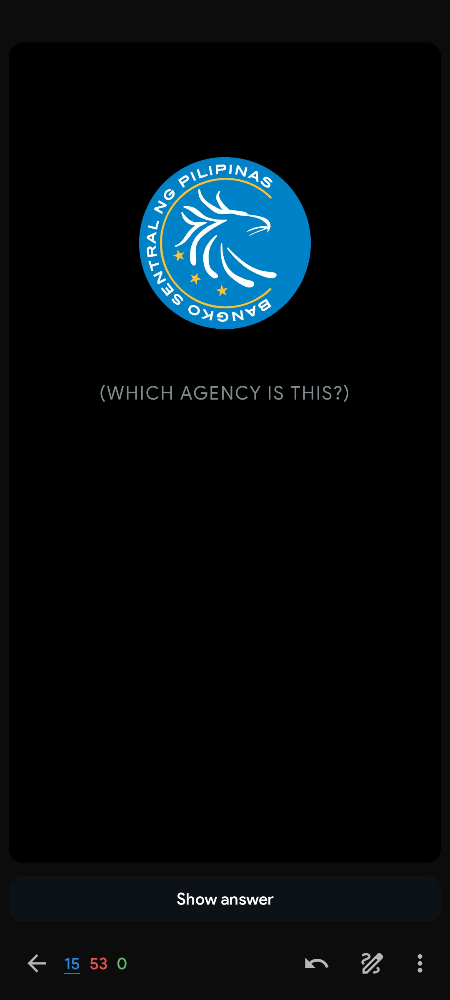
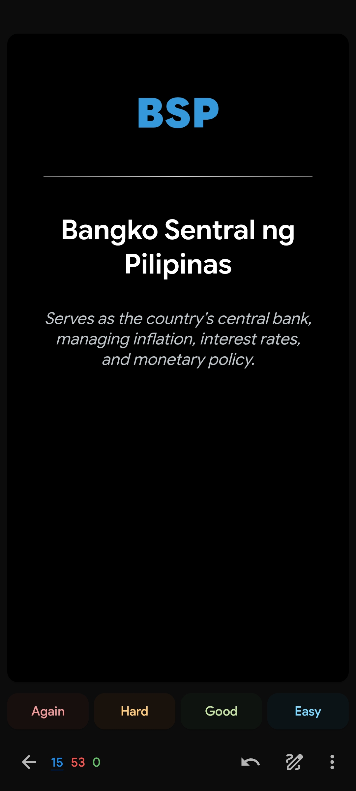

# AGAP: Anki Government Agencies of the Philippines

**The ultimate flashcard deck for remembering Philippine Government Agency acronyms, official names, and logos.**

This project uses **[Brain Brew](https://github.com/ohare93/brain-brew)** to manage flashcard data in CSV format, allowing for easy updates and version control.

## ✨ Features
*   **70+ Major PH Gov Agencies**: Includes departments (e.g., DepEd, DOH), bureaus (e.g., BIR, BOC), and commissions (e.g., COMELEC, CSC).
*   **Three Card Types**:
    1.  **Acronym ➔ Full Name**
    2.  **Full Name ➔ Acronym**
    3.  **Logo ➔ Acronym** (Includes official SVG/PNG seals for all agencies!)
*   **Smart Phonetic TTS**

### 📸 Preview
| Card Type | Front (Question) | Back (Answer) |
| --- | --- | --- |
| **Acronym ➔ Full Name** |  |  |
| **Full Name ➔ Acronym** |  |  |
| **Logo ➔ Acronym** |  |  |
## 🚀 How to Build & Import

### 1. Requirements
*   [Python 3.12+](https://www.python.org/)
*   [Anki](https://apps.ankiweb.net/)
*   [CrowdAnki Add-on](https://ankiweb.net/shared/info/1788670778)

### 2. Setup & Asset Download
1. Clone this repository.
2. Install dependencies:
   ```bash
   pip install pipenv
   pipenv install
   ```
3. **Download Logos**: Run the following command to fetch official seals from Wikimedia Commons:
   ```bash
   pipenv run download
   ```

### 3. Build the Deck
Generate the Anki-ready data:
```bash
pipenv run build
```
This creates folders in `build/AGAP` and `build/AGAP_TTS`.

### 4. Import into Anki
1. Open Anki.
2. Select **File ➔ CrowdAnki: Import from disk**.
3. Go to the `build/AGAP` (or `build/AGAP_TTS`) folder.

## 🤝 Contributing
To add a new agency or update a logo:
1. Add the agency to `src/data/agap.csv`.
2. Find the official Wikimedia Commons URL for the seal.
3. Add the mapping to `sources.csv`.
4. Run `pipenv run download` to fetch the new asset.
5. See [CONTRIBUTING.md](CONTRIBUTING.md) for more details.

## 📚 Credits
Special thanks to **GMA News Online** for providing the PH Gov agency info and descriptions used throughout this project:
*   [Guide: Key PH government acronyms to know](https://www.gmanetwork.com/news/topstories/nation/981955/guide-key-ph-government-acronyms-to-know/story/)

Logos are sourced from **Wikimedia Commons**.

## 🛠️ Troubleshooting
### `APP_MISSING_VOICE` error (AnkiDroid) on AGAP_TTS
On Android, by default it uses the **Google Speech Synthesis** engine. If you encounter a `Text to speech error (APP_MISSING_VOICE)`:
1.  Open your Android **Settings**.
2.  Navigate to **System ➔ Languages & input ➔ Output ➔ Text-to-speech output** (this path may vary slightly by device).
3.  Tap the settings gear next to your Preferred engine (typically Google).
4.  Select **Install voice data** and ensure **English (United States)** is downloaded and installed.

## 📄 License
Public Domain (Unlicense). Logos are subject to their respective Wikimedia licenses.
